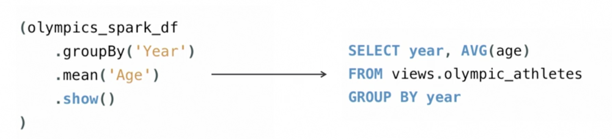

   Apache Spark Learning Note: Day01 - What is Apache Spark
==============================================================
Update: 2021-05-10
Initial: 2021-05-06

   **Apache Spark** is a unified engine designed for large-scale distributed data processing, on-premises in data centers or in the cloud. It provides in-memory storage for intermediate computations, making it much faster than Hadoop MapReduce. It incorporates libraries with composable APIs for machine learning (MLlib), SQL for interactive queries (Spark SQL), stream processing (Structured Streaming) for interacting with real-time data, and graph processing (GraphX).  

 

#### Design philosophy centers around four key characteristics:  

* Speed     
> The advantage of Spark is that the underlying Unix-based operating system taking advantage of efficient multithreading and parallel processing. With all the intermediate results retained in memory and its limited disk I/O, this gives it a huge performance boost.     

* Ease of use     
> Spark achieves simplicity by providing a fundamental abstraction of a simple logical data structure called a Resilient Distributed Dataset (RDD) upon which all other higher-level structured data abstractions, such as DataFrames and Datasets, are constructed. By providing a set of transformations and actions as operations, Spark offers a simple programming model that can use to build big data applications in familiar languages.     

* Modularity & Extensibility     
> Spark operations can be applied across many types of workloads and expressed in any of the supported programming languages: Scala, Java, Python, SQL, and R, which allows one single Spark application that can do it all—no need for distinct engines for disparate workloads, no need to learn separate APIs. Spark also focuses on its fast, parallel computation engine rather than on storage. In other words, you can render data from other sources, such as Apache Kafka, Kinesis, Azure Storage, and Amazon S3, into its logical data abstraction, on which it can operate.     

  

#### Resilient Distributed Datasets (RDDS)  

* Data structure that maintains data across multiple nodes  

* Immutable (read-only), partitioned collection of elements  

* Tracks data lineage information to recover lost data  

* Supports two types of operations: transformations (function-like: filter(), map(), groupBykey(), union ()) and actions (e.g., count(), first(), collect(), reduce()). Transformations result in tranformed RDDs, while actions result in a single result.  

#### Programing Interface   

* PySpark  
	* Python API for Spark   
	* DataFrame Abstraction, like Pandas. Actually, it is more like "Dask"  

* Java  

* Scala  

